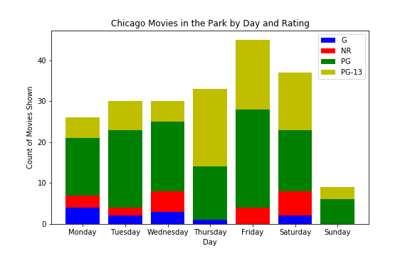

# Pandas Warmup

Pandas out yer ears

Run the cell below w/o changes to load tests


```python
#run without changes

from test_background import pkl_dump, test_obj_dict, run_test_dict, run_test
```

## Data setup

Import: 

- Pandas under the alias 'pd'

- Matplotlib.pyplot under the alias 'plt'

Run:
- %matplotlib inline


```python
#Your code here
```

#### Make a dataframe by reading in the csv 'Chicago_Park_District__Movies_in_the_Parks_2019' which is in the "data" folder  

#### Assign the dataframe to the variable 'movies'

#### Look at the first five rows


```python
#Your code here
```

#### What kind of type is the data in the Date column?  Turn it into a datetime type if it's not already


```python
#Your code here
```

#### Replace the truncated days of the week in the Days column with the full string of the day of the week using the Date column

[*Hint*](https://pandas.pydata.org/pandas-docs/version/0.25.0/reference/api/pandas.Series.dt.day_name.html)


```python
#Your code here
```

#### Sort `movies` by the Day column, with 'Monday' first and 'Sunday' last

[*Hint*](https://pandas.pydata.org/pandas-docs/version/0.25.0/reference/api/pandas.Categorical.html#pandas.Categorical)


```python
#Your code here
```

## Data Exploration

#### What is the most frequent place to show a movie?  (Remember that there might be a tie!)

#### Assign your answer to the variable `venue_max` as a list of one or more strings


```python
#Your code here
```


```python
#test your answer here

run_test(venue_max, 'venue_max')
```

#### What's the area code in which movies are shown most frequently?

#### Assign your answer to the variable `area_code` as an integer


```python
#Your code here
```


```python
#run this cell to test your answer

run_test(area_code, 'area_code')
```

## Data Manipulation

#### Group the data by what day of the week the movies are shown using `.groupby()`

#### Assign to the variable `movies_grp_day` 
(concept check: what type of object is this?)

#### Using `movies_grp_day`, assign to `movies_per_day` a series where the index is the day of the week and the values are total counts of movies per day 

#### Again using `movies_grp_day`, assign to `unique_movies_per_day` a series where the index is the day of the week and the values are unique counts of movies per day of the week.

#### Use `movies_per_day` and `unique_movies_per_day` to calculate a series of how many movie showings per day of the week are of movies that are shown more than once.  Assign this series to `repeats`

#### Sort `repeats` so Monday is the first entry and Sunday is the last


```python
#Your code here
```


```python
#test your answer here

run_test(repeats, 'repeats')
```

#### Which day of the week has the fewest underwriters?  Run a calculation that results in a string (ie, don't run a calculation which displays the answer somewhere and then create a new string with the answer)

#### Assign that string to `day_underwriter_min`


```python
#Your code here
```


```python
#test your answer here

run_test(day_underwriter_min, 'day_underwriter_min')
```

#### Using `movies_grp_day`, assign the variable `model_ratings_day` to a series where the index is the days of the week and the values are the modal rating for movies shown that day

#### Sort so that the first index is Monday and the last is Sunday


*Hint: look at [the groupby documentation](https://pandas.pydata.org/pandas-docs/version/0.23.4/generated/pandas.core.groupby.DataFrameGroupBy.agg.html) and write a function*


```python
#Your code here
```


```python
#test your answer here
run_test(modal_ratings_day, 'modal_ratings_day')
```

## Strrretch Goal

#### Make a stacked bar chart showing the ratings of movies across days of the week using fig and ax objects

#### Title the x-axis "Day"

#### Title the y-axis "Count of Movies Shown"

#### Title the chart as a whole "Chicago Movies in the Park by Day and Rating"

[*Hint*](https://matplotlib.org/3.1.1/gallery/lines_bars_and_markers/bar_stacked.html)

When you're done it should look like this (w/ figsize 8,5):




```python
#Your code here
```


```python

```
